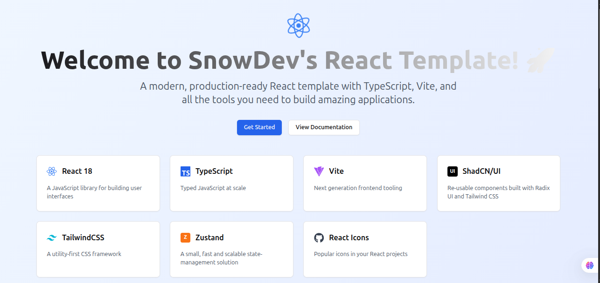
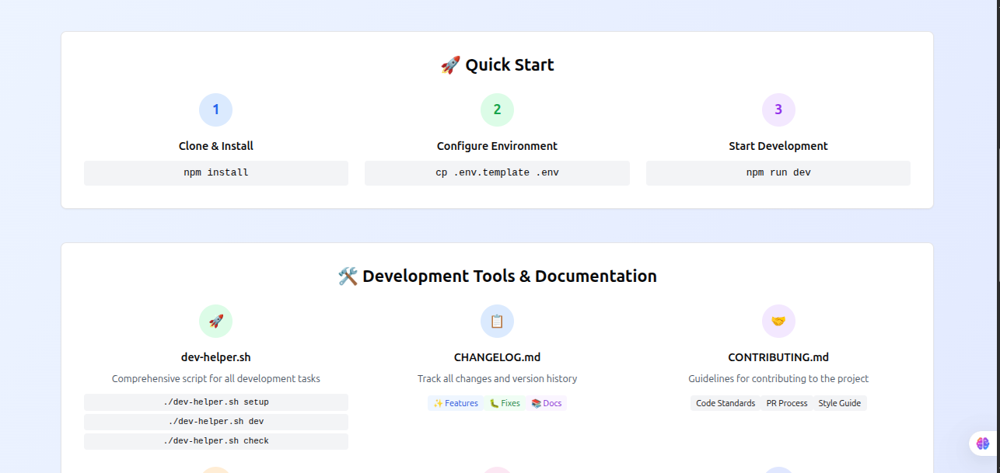

# 🚀 React + TypeScript + Vite Frontend Template by SnowDev

<div align="center">


**A modern, production-ready React frontend template with all the tools you need to build amazing client-side applications.**



[🚀 Quick Start](#-quick-start) • [📖 Documentation](#-documentation) • [🛠️ Features](#️-features) • [🐳 Docker](#-docker-support)

</div>

---

## �️ Template Preview

Get a glimpse of what you'll be working with:

### Hero Section & Technology Showcase

*Beautiful welcome page showcasing all included technologies and dependencies*

### Quick Start Guide & Development Tools

*Comprehensive development tools section with helper scripts and workflow guidance*

### Development Workflow Overview

*Visual representation of the complete development process from setup to deployment*

---

## �📋 Table of Contents

- [🎯 Overview](#-overview)
- [✨ Features](#-features)
- [🛠️ Tech Stack](#️-tech-stack)
- [🚀 Quick Start](#-quick-start)
- [📁 Project Structure](#-project-structure)
- [🔧 Configuration](#-configuration)
- [🐳 Docker Support](#-docker-support)
- [📜 Available Scripts](#-available-scripts)
- [🎨 Styling & Components](#-styling--components)
- [🔒 Environment Variables](#-environment-variables)
- [🧪 Testing](#-testing)
- [🚀 Deployment](#-deployment)
- [🤝 Contributing](#-contributing)
- [📄 License](#-license)

## 🎯 Overview

This template is a comprehensive starter kit for building modern React frontend applications. Created by **@DimitriTedom (SnowDev)** for the developer community at **Worketyamo-Students**, it integrates the best practices and most popular tools in the React ecosystem for client-side development.

Perfect for:
- 🏢 Enterprise frontend applications
- 📱 SaaS dashboards and interfaces
- 🛍️ E-commerce frontend experiences
- 📊 Data visualization and admin panels
- 🎨 Portfolio and marketing websites
- 🌐 Progressive Web Apps (PWAs)

## ✨ Features

### 🏗️ Core Features
- ⚡ **Lightning Fast**: Powered by Vite for instant hot reload
- 🎯 **Type Safe**: Full TypeScript support with strict configuration
- 🎨 **Modern UI**: Pre-built components with ShadCN/UI
- 📱 **Responsive**: Mobile-first design with TailwindCSS
- 🔄 **State Management**: Zustand for simple and powerful state management
- 🎭 **Icon Library**: Comprehensive icon set with React Icons

### 🛠️ Developer Experience
- 🔧 **Pre-configured**: ESLint, Prettier, and TypeScript ready
- 🐳 **Docker Ready**: Multi-stage Dockerfile with optimization
- 📝 **Environment Templates**: Comprehensive .env.template
- 🎨 **Custom Tailwind Layers**: Organized CSS with base, components, and utilities
- 🔒 **Security**: Best practices for secure applications

### 🚀 Production Ready
- 📦 **Optimized Builds**: Tree-shaking and code splitting
- 🔍 **SEO Friendly**: Meta tags and proper HTML structure
- ♿ **Accessible**: WCAG compliant components
- 🌐 **i18n Ready**: Internationalization support structure

### 🎨 Visual Design
- 🖼️ **Beautiful Welcome Page**: Showcases all technologies with interactive elements
- 📱 **Responsive Layout**: Mobile-first design that works on all devices
- 🌙 **Dark Mode Ready**: CSS variables for easy theme switching
- ✨ **Smooth Animations**: Custom keyframe animations for better UX
- 🎯 **Developer Guidance**: Visual workflow and tool explanations

## 🛠️ Tech Stack

| Category | Technology | Version | Purpose |
|----------|------------|---------|---------|
| **Framework** | React | 18.3.1 | UI Library |
| **Language** | TypeScript | 5.5.3 | Type Safety |
| **Build Tool** | Vite | 5.4.8 | Fast Development & Build |
| **Styling** | TailwindCSS | 3.4.13 | Utility-first CSS |
| **UI Components** | ShadCN/UI | Latest | Pre-built Components |
| **State Management** | Zustand | 5.0.0-rc.2 | Global State |
| **Icons** | React Icons | 5.3.0 | Icon Library |
| **Linting** | ESLint | 9.11.1 | Code Quality |
| **Container** | Docker | - | Containerization |

## 🚀 Quick Start

### Prerequisites
- Node.js 18+ 
- npm or yarn or pnpm
- Git

### 1. Clone & Setup
```bash
# Clone the repository
git clone https://github.com/DimitriTedom/SnowDev-ReactJs-Template.git

# Navigate to project directory
cd My-React-APP_Template-SnowDev

# Install dependencies
npm install
```

### 2. Environment Configuration
```bash
# Copy environment template
cp .env.template .env

# Edit your environment variables
nano .env  # or your preferred editor
```

### 3. Start Development
```bash
# Start development server
npm run dev

# Open http://localhost:5173
```

### 4. Start Building! 🎉
You're ready to start building your amazing application!


## 📁 Project Structure

```
My-React-APP_Template-SnowDev/
├── 📁 public/                  # Static assets
│   └── vite.svg               # Vite logo
├── 📁 src/                    # Source code
│   ├── 📁 components/         # Reusable components
│   │   └── 📁 ui/            # ShadCN UI components
│   │       └── button.tsx     # Button component
│   ├── 📁 lib/               # Utility functions
│   │   └── utils.ts          # Helper utilities
│   ├── App.tsx               # Main application component
│   ├── index.css             # Global styles & Tailwind
│   ├── main.tsx              # Application entry point
│   └── vite-env.d.ts         # Vite type definitions
├── 📄 .env.template          # Environment variables template
├── 📄 components.json        # ShadCN configuration
├── 📄 Dockerfile            # Docker configuration
├── 📄 eslint.config.js       # ESLint configuration
├── 📄 index.html             # HTML entry point
├── 📄 LICENSE                # MIT License
├── 📄 nginx.conf             # Nginx configuration
├── 📄 package.json           # Dependencies & scripts
├── 📄 postcss.config.js      # PostCSS configuration
├── 📄 README.md              # Documentation
├── 📄 tailwind.config.js     # TailwindCSS configuration
├── 📄 tsconfig.json          # TypeScript configuration
├── 📄 tsconfig.app.json      # TypeScript app configuration
├── 📄 tsconfig.node.json     # TypeScript node configuration
└── 📄 vite.config.ts         # Vite configuration
```

## 🔧 Configuration

### TailwindCSS Layers
Our CSS is organized into three layers:

#### 🎨 **@layer base**
- CSS reset and normalization
- Theme variables (light/dark mode)
- Global styles and typography

#### 🧩 **@layer components**
- Reusable component classes
- Card, button, form components
- Layout helpers (flex-center, grid-responsive)

#### 🛠️ **@layer utilities**
- Custom utility classes
- Animations and effects
- Debug utilities (remove in production)

### ShadCN/UI Configuration
```json
{
  "style": "default",
  "rsc": false,
  "tsx": true,
  "tailwind": {
    "config": "tailwind.config.js",
    "css": "src/index.css"
  },
  "aliases": {
    "components": "@/components",
    "utils": "@/lib/utils"
  }
}
```

## 🐳 Docker Support

### Development Container
```bash
# Build development image
docker build --target development -t my-react-app:dev .

# Run development container
docker run -p 5173:5173 -v $(pwd):/app my-react-app:dev
```

### Production Container
```bash
# Build production image
docker build --target production -t my-react-app:prod .

# Run production container
docker run -p 80:80 my-react-app:prod
```

### Multi-stage Dockerfile Features
- 🏗️ **Builder stage**: Optimized Node.js build
- 🚀 **Production stage**: Lightweight Nginx server
- 🔒 **Security**: Non-root user, minimal attack surface
- ⚡ **Performance**: Gzip compression, caching headers
- 🏥 **Health checks**: Built-in container health monitoring

## 📜 Available Scripts

| Script | Command | Description |
|--------|---------|-------------|
| **Development** | `npm run dev` | Start development server with HMR |
| **Build** | `npm run build` | Build for production |
| **Preview** | `npm run preview` | Preview production build locally |
| **Lint** | `npm run lint` | Run ESLint for code quality |
| **Type Check** | `npm run type-check` | Run TypeScript compiler check |

### Custom Scripts (Add to package.json)
```json
{
  "scripts": {
    "docker:build": "docker build -t my-react-app .",
    "docker:run": "docker run -p 80:80 my-react-app",
    "docker:dev": "docker build --target development -t my-react-app:dev . && docker run -p 5173:5173 my-react-app:dev"
  }
}
```

## 🎨 Styling & Components

### Pre-built Component Classes
```css
/* Layout */
.container        /* Responsive container */
.flex-center      /* Flex center alignment */
.flex-between     /* Flex space-between */
.grid-responsive  /* Responsive grid layout */

/* Components */
.card            /* Card container */
.btn             /* Base button */
.btn-primary     /* Primary button variant */
.form-input      /* Form input styling */

/* Utilities */
.text-gradient   /* Gradient text effect */
.glass           /* Glassmorphism effect */
.animate-in      /* Slide-in animation */
```

### ShadCN Components Available
- Button with variants
- Card components
- Form elements
- Layout components
- Navigation elements

### Adding New Components
```bash
# Add ShadCN components
npx shadcn-ui@latest add dialog
npx shadcn-ui@latest add dropdown-menu
npx shadcn-ui@latest add form
```

## 🔒 Environment Variables

### Client-side Variables (VITE_ prefix)
```env
VITE_APP_NAME="My React App"
VITE_API_URL="http://localhost:3001/api"
VITE_DEBUG_MODE="false"
```

### Server-side Variables
```env
JWT_SECRET="your-secret-key"
API_SECRET="your-api-secret"
```

### Security Best Practices
- ✅ Never expose secrets to client-side
- ✅ Use VITE_ prefix only for public variables
- ✅ Validate environment variables on startup
- ✅ Use different .env files for different environments

## 🧪 Testing

### Setup Testing Framework
```bash
# Install testing dependencies
npm install -D vitest @testing-library/react @testing-library/jest-dom

# Add to package.json
{
  "scripts": {
    "test": "vitest",
    "test:ui": "vitest --ui",
    "test:coverage": "vitest --coverage"
  }
}
```

### Example Test Structure
```
src/
├── __tests__/           # Test files
├── components/
│   └── __tests__/      # Component tests
└── utils/
    └── __tests__/      # Utility tests
```

## 🚀 Deployment

### Vercel (Recommended)
```bash
# Install Vercel CLI
npm i -g vercel

# Deploy
vercel
```

### Netlify
```bash
# Build command: npm run build
# Publish directory: dist
```

### Docker Production
```bash
# Build and run
docker build -t my-react-app .
docker run -p 80:80 my-react-app
```

### Environment-specific Builds
```bash
# Staging
VITE_NODE_ENV=staging npm run build

# Production  
VITE_NODE_ENV=production npm run build
```


## 🤝 Contributing

We welcome contributions! Please follow these guidelines:

### Development Setup
1. Fork the repository
2. Create a feature branch: `git checkout -b feature/amazing-feature`
3. Make your changes
4. Run tests: `npm test`
5. Commit changes: `git commit -m 'Add amazing feature'`
6. Push to branch: `git push origin feature/amazing-feature`
7. Open a Pull Request

### Code Standards
- ✅ Follow TypeScript best practices
- ✅ Use meaningful commit messages
- ✅ Add tests for new features
- ✅ Update documentation
- ✅ Follow existing code style

### Issue Templates
- 🐛 **Bug Report**: Describe the issue with reproduction steps
- 💡 **Feature Request**: Propose new features or improvements
- 📚 **Documentation**: Improve or fix documentation

## 👥 Community & Support

- 💬 **Discussions**: [GitHub Discussions](https://github.com/DimitriTedom/SnowDev-ReactJs-Template/discussions)
- 🐛 **Issues**: [GitHub Issues](https://github.com/DimitriTedom/SnowDev-ReactJs-Template/issues)
- 📖 **Wiki**: [Project Wiki](https://github.com/DimitriTedom/SnowDev-ReactJs-Template/wiki)

## 🙏 Acknowledgments

Special thanks to:
- **Worketyamo-Students** community for inspiration
- **React Team** for the amazing framework
- **Vite Team** for the lightning-fast build tool
- **TailwindCSS Team** for the utility-first CSS framework
- **ShadCN** for the beautiful component library

## 📄 License

This project is licensed under the **MIT License** - see the [LICENSE](LICENSE) file for details.

---

<div align="center">

**Built with ❤️ by [DimitriTedom (SnowDev)](https://github.com/DimitriTedom)**

**For the amazing developers at Worketyamo-Students 🎓**

[⭐ Star this repo](https://github.com/DimitriTedom/SnowDev-ReactJs-Template.git) if you found it helpful!

</div>

